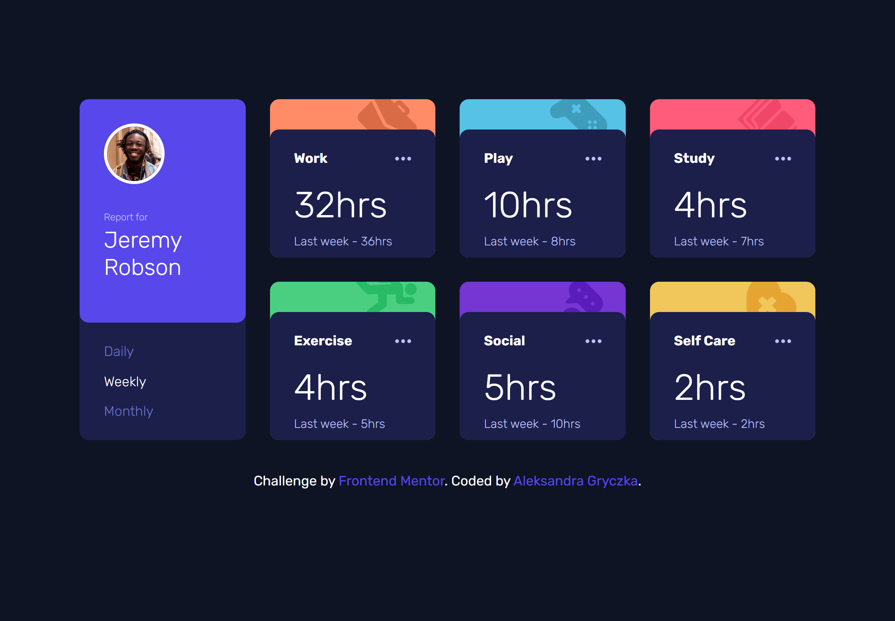
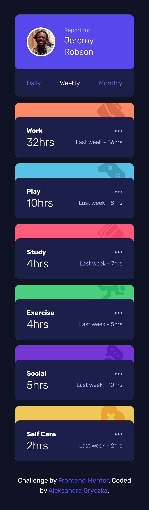

# Frontend Mentor - Time tracking dashboard solution
This is a solution to the [Time tracking dashboard challenge on Frontend Mentor](https://www.frontendmentor.io/challenges/time-tracking-dashboard-UIQ7167Jw). Frontend Mentor challenges help you improve your coding skills by building realistic projects.
## Table of contents
- [Overview](#overview)
  - [The challenge](#The-challenge)
  - [Screenshot](#Screenshot)
  - [Links](#Links)
- [My process](#My-process)
  - [Built with](#Built-with)
  - [What I learned](#What-I-learned)
- [Author](#Author)

## Overview
### The challenge
Users should be able to:

- View the optimal layout for the site depending on their device's screen size
- See hover states for all interactive elements on the page

### Screenshot

## Links
- Solution URL: [Github](https://github.com/Emmettek/time-tracking-dashboard)
- Live Site URL: [Github Pages](https://emmettek.github.io/time-tracking-dashboard/)

## My process
### Built with
- Semantic HTML5 markup
- Tailwind CSS
- Flexbox
- CSS Grid
- Mobile-first workflow

### What I learned
I learned how to use CSS Grid in Tailwind CSS.

## Author
- LinkedIn - [@gryczkaleksandra01](https://www.linkedin.com/in/gryczkaleksandra01/)
